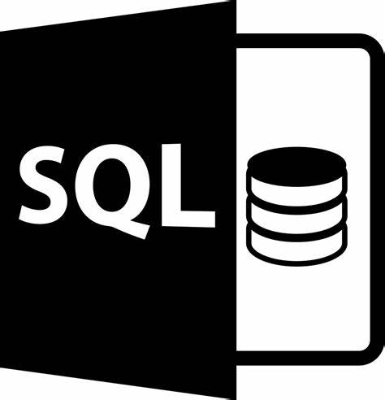
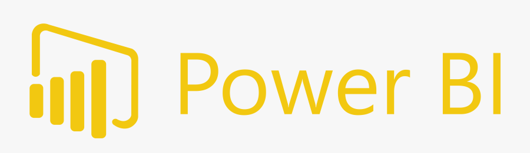

##
<h1 align="left"> Skills </h1>

  <code></code>  
  <code></code>
  <code></code>
  <code></code>
  <code></code>  

 

### Olá, sou Rafael Pires

-🔌 Trabalho atualmente com Análise de Dados em uma utility

