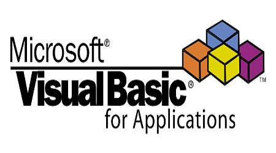

<!-- Banner Superior -->
  
 

<!-- Ferramentas para Abalytics -->
  <h1 align="left"> Caixa de Ferramentas </h1>
  

      
      
      
      
      
      
    
  
   

<!-- Sobre mim -->
<h1 align="left"> Sobre mim </h1>
### Olá, sou Rafael Pires

  -🔌 Trabalho atualmente com Análise de Dados em uma utility
   
  
<!-- Meus contatos -->
<h1 align="left"> Meus Contatos </h1>
<a>
  <href = "malito:rpiresoliver@gmail.com"><image src = "https://img.shields.io/badge/Gmail-D14836?style=for-the-badge&logo=gmail&logoColor=white">
</a

  

