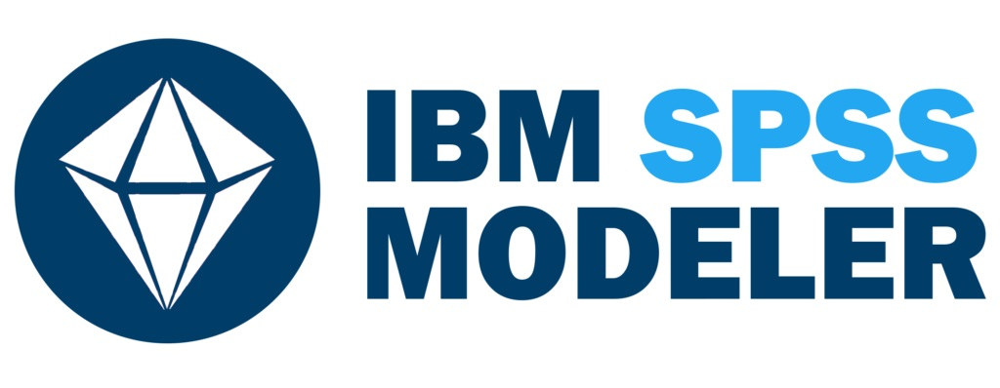

<!-- Banner Superior -->
  
 

<!-- Ferramentas para Abalytics -->
  <h1 align="left"> Caixa de Ferramentas </h1>
  

      
      
      
      
      
      
    
  
   
  
<!-- Estudando Atualmente  -->
<h1 align="left"> Estudando Atualmente </h1>
  

      
      
      
    
  
   

<!-- Sobre mim -->
<h1 align="left"> Um pouco sobre mim </h1>

Olá, sou Rafael Pires
  - Casado, tenho três lindos filhos
  - Trabalho atualmente com Recuperação de Receitas em uma Distribuidora de Energia
  - Em meu tempo livre adoro fazer churrasco
  - Sou apaixonado por dados e estudo continuamente sobre o assunto
  - Utilizo analytics diariamente em minha rotina para potencializar resultados
  - Meu principal objetivo é identificar e resolver problemas

<h3 align="left"> Soft Skills </h3>

  - Atitude positiva
  - Resiliência
  - Adaptabilidade
  - Comunicação assertiva
  - Motivação
  - Trabalho em equipe

     

<!-- Meus contatos -->
<h1 align="left"> Contatos </h1>

  <a href = "https://www.linkedin.com/in/rafael-pires-de-oliveira-37003a164?    lipi=urn%3Ali%3Apage%3Ad_flagship3_profile_view_base_contact_details%3BQE%2FeecZxS0eD%2FMyQkIJI3g%3D%3D"><image src="https://img.shields.io/badge/LinkedIn-0077B5?style=for-the-badge&logo=linkedin&logoColor=white" title = "Visitar meu Linkedin"></a>

  

